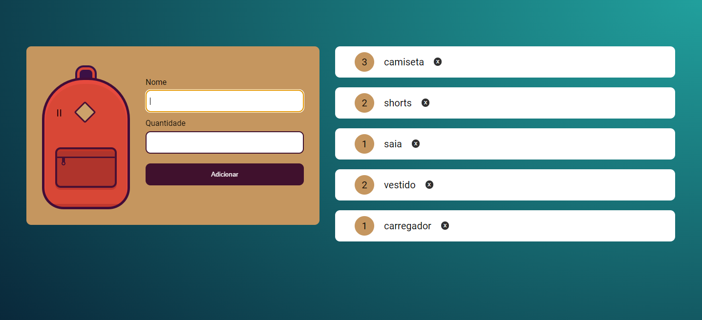
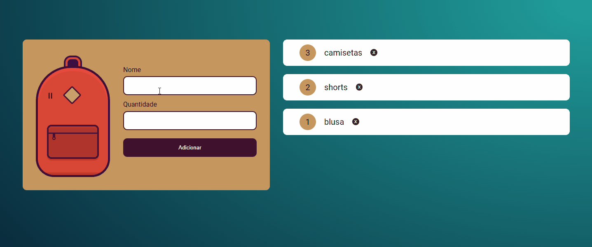

# Mochila de Viagem | JavaScript na Web: armazenando dados no navegador

Este repositório contém o projeto Mochila de Viagem desenvolvido durante o curso "JavaScript na Web: armazenando dados no navegador" oferecido pela [Alura](https://www.alura.com.br/) Escola Online de Tecnologia.

## 📁 Detalhes do projeto

	

 

O projeto Mochila de Viagem possui uma página com um formulário para adicionar itens na sua lista de viagem. O usuário pode adicionar, atualizar e remover esses itens. 

O commit initial project é referente aos arquivos HTML e CSS disponibilizados pelo instrutor do curso.

## 📚 Temas abordados

* Capturar dados de um formulário;
* Prevenir evento padrão com `preventDefault()`;
* Criar elementos HTML com `createElement()`;
* Armazenar dados localmente com o Local Storage;
* Converter objeto JavaScript em uma string JSON com `JSON.stringify()`;
* Armazenar o dados do Local Storage em uma array;
* Converter string JSON para objeto JavaScript com `JSON.parse()`;
* Usar loop do array `forEach()` para manter os itens após recarregar a página;
* Atualizar itens no navegador e no Local Storage;
* Criar botão via JS para remover itens da lista;
* Refatorar código para melhor legibilidade;
* Resolver incompatibilidades de código durante o desenvolvimento.

## 🖥️ Acesso ao projeto

[Clique aqui](https://mochila-de-viagem-tan.vercel.app/) para acessar o site Mochila de Viagem no seu navegador.

	

 

Após acessar o projeto basta digitar o item e a quantidade que deseja adicionar a sua lista. 

Se precisar atualizar algum item digite novamente o nome do item, altere a quantidade e adicione novamente.

Caso precise remover itens clique no botão com um x ao lado de cada item.

## 👩‍💻 Tecnologias utilizadas

	
	
	

Desenvolvido com 💙 por [Juliana Lucca](https://www.linkedin.com/in/julianalucca/)
